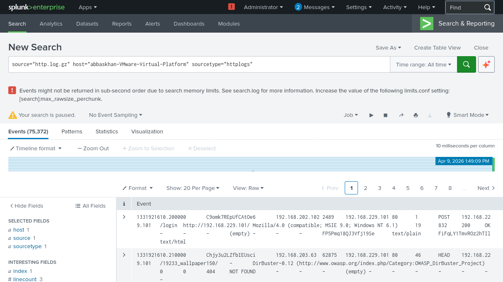

# HTTP Log Analysis Using Splunk SIEM

## Introduction
HTTP (Hypertext Transfer Protocol) logs provide detailed information about web traffic, including client requests, server responses, and user behavior. These logs are critical for monitoring, troubleshooting, and detecting potential security threats.

This project focuses on analyzing HTTP log data using Splunk SIEM to identify patterns, detect anomalies, and perform basic threat hunting.

### Splunk Data Search Interface

## Objectives
- Ingest HTTP log data into Splunk
- Extract and analyze important fields
- Understand web traffic behavior
- Detect anomalies and suspicious activity
- Document findings in a structured report

## Data Source
Sample HTTP log data is used for analysis. The dataset contains HTTP requests, response codes, URLs, and user-agent information.

## Tools Used
- Splunk SIEM
- HTTP log dataset

## Methodology
1. Upload HTTP logs into Splunk
2. Extract relevant fields such as method, URI, status, and IPs
3. Run SPL queries to analyze traffic patterns
4. Identify anomalies and suspicious behavior
5. Document findings in the report

## Status
## Project Status

Completed:
- HTTP log ingestion into Splunk
- Field extraction (src_ip, dst_ip, method, status, URI)
- Traffic analysis (methods, URLs, status codes)
- Detection of suspicious activity (DirBuster web enumeration)
- Documentation of findings with evidence

