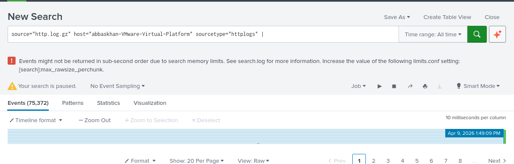
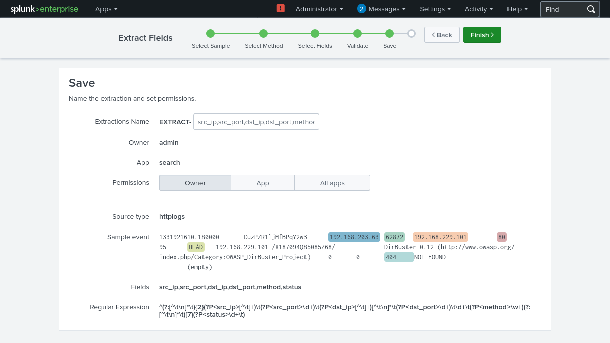
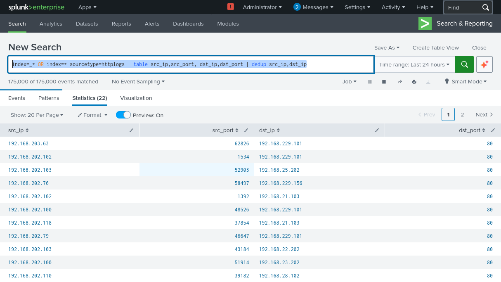
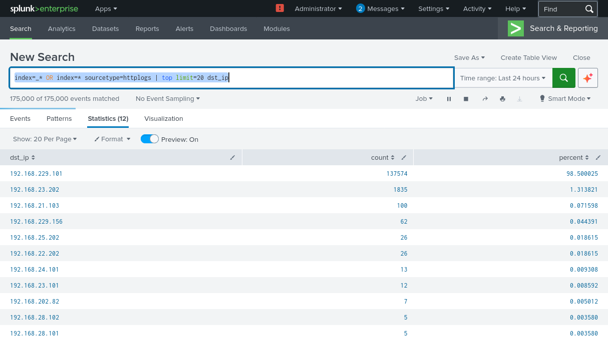
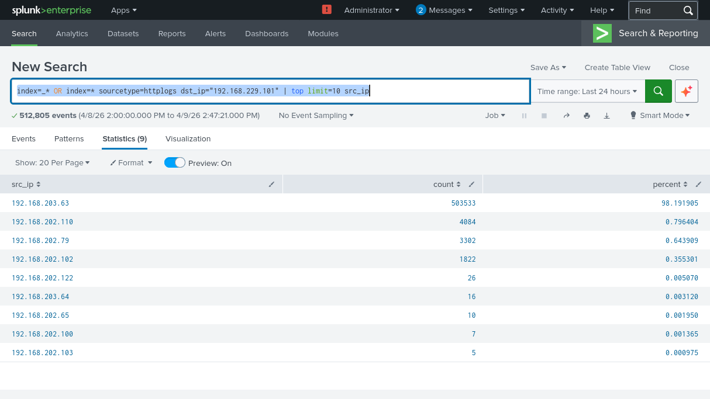
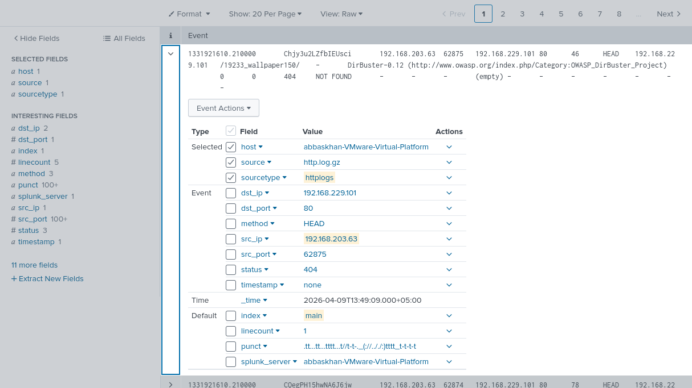

1. Search for HTTP Events

    Open Splunk interface and navigate to the search bar.
    Enter the following search query to retrieve HTTP events:
---

source="http.log.gz" host="abbaskhan-VMware-Virtual-Platform" sourcetype="httplogs"
--

2. Extract Relevant Fields

    Identify key fields in HTTP logs such as timestamps, request methods, URLs, response codes, user agents, etc.
    Use Splunk's field extraction capabilities or regular expressions to extract these fields for better analysis.
    Example extraction command:

---
source="http.log.gz" host="abbaskhan-VMware-Virtual-Platform" sourcetype="httplogs"| src_ip,src_port,dst_ip,dst_port,method,
--

3. Analyze Web Traffic Patterns

    Determine the distribution of request methods (GET, POST, etc.) to understand web traffic patterns.

---

index=_* OR index=* sourcetype=httplogs | table src_ip,src_port, dst_ip,dst_port | dedup src_ip,dst_ip
--

---

index=_* OR index=* sourcetype=httplogs | top limit=20 dst_ip
--

---

index=_* OR index=* sourcetype=httplogs dst_ip="192.168.229.101" | top limit=10 src_ip
--

4. Detect Anomalies

    Look for unusual patterns in file transfer activity.
---

index=_* OR index=* sourcetype=httplogs | stats count by status | where stats>=400
--

---

index=_* OR index=* sourcetype=httplogs | search action="login" status="failed"
| stats count by user
--

---
index=_* OR index=* sourcetype=httplogs src_ip="192.168.203.63"
--

| Field            | Value                |
| ---------------- | -------------------- |
| Source IP        | 192.168.203.63       |
| Source Port      | 62875                |
| Destination IP   | 192.168.229.101      |
| Destination Port | 80 (HTTP)            |
| Method           | HEAD                 |
| URL              | /19233_wallpaper150/ |
| Status           | 404 (NOT FOUND)      |
| Tool/User-Agent  | DirBuster            |
| Sourcetype       | httplogs             |

###  Conclusion

This activity is classified as **malicious**.

The use of DirBuster indicates an active attempt to enumerate directories on the web server. This is a common reconnaissance technique used before launching further attacks.